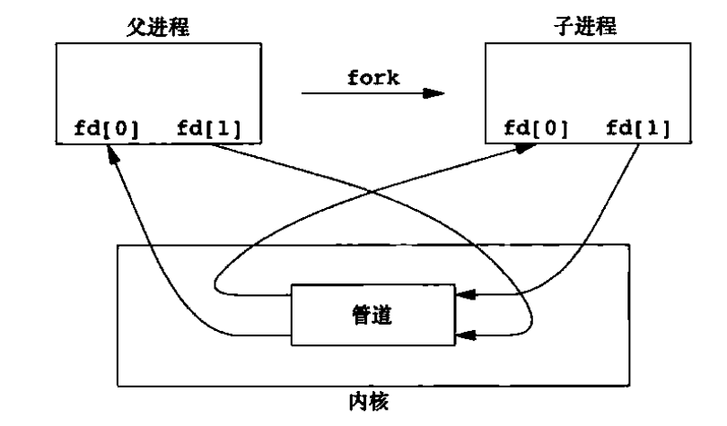
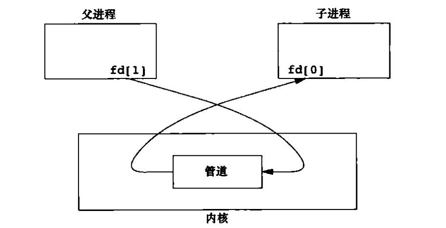
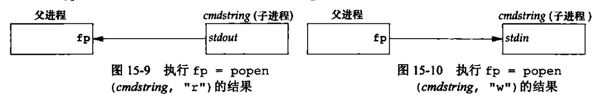

# IPC通讯方式

- 管道

    管道是半双工（即数据只能在一个方向上流动）的，且只能在具有公共祖先的两个进程间使用。
    
    通常一个管道由一个进程创建，在进程调用fork后，该管道就可以在父进程和子进程之间使用了。
    
    函数原型：
    ```c
    #include <unistd.h>
    int pipe(int fd[2])
    ```
    fd返回两个文件描述符：fd[0]为读而打开、fd[1]为写而打开。fd[1]的输出是fd[0]的输入。
    
    单个进程中的管道几乎没有任何用处。通常，进程会先调用pipe，接着调用fork，从而创建从父进程到子进程的IPC通道，反之亦然。
    
    fork之后的半双工管道：
    
    
    
    从父进程到子进程的管道：
    
    
    
    其它创建管道的方式：
    
    ```c
    #include <unistd.h>
    FILE *popen(const char *cmdstring, const char *type);
    int pclose(FILE *fp);
    ```
    
    函数popen先执行fork，然后调用exec执行cmdstring，并且返回一个标准I/O文件指针。如果type是“r”，则文件指针连接到cmdstring的标准输出；如果type是“w“，则文件指针连接到cmdstring的标准输入
    
    

- FIFO
- 消息队列
- 信号量
- 共享存储
- 信号
- unix domain socket

# Linux多线程
