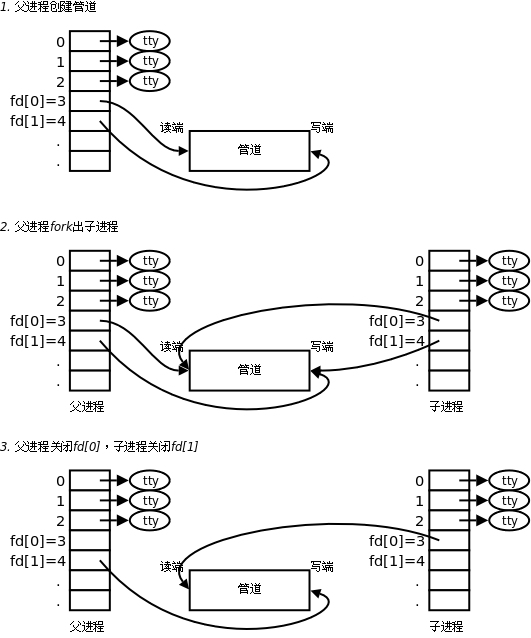

### Linux进程间通讯

---

进程间通讯(IPC InterProcess Communication)是指在进程间交换信息，一般常见的IPC方法有管道pipe、消息队列、共享内存、信号、socket套接字等。
下面将就各种方法简单举例总结。

- 管道pipe

  - 匿名管道
    <br>

        #include <uinstd.h>
        int pipe(int pipefd[2]);

    调用pipe函数时在内核中开辟一块缓冲区（称为管道）用于通信，它有一个读端一个写端，然后通过pipefd参数传出给用户程序两个文件描述符，pipefd[0]指向管道的读端，pipefd[1]指向管道的写端。所以管道在用户程序看起来就像一个打开的文件，通过read(pipefd[0]);或者write(pipefd[1]);向这个文件读写数据其实是在读写内核缓冲区。pipe函数调用成功返回0，调用失败返回-1。

    <br>

    

    1. 父进程调用pipe开辟管道，得到两个文件描述符指向管道的两端。
    2. 父进程调用fork创建子进程，那么子进程也有两个文件描述符指向同一管道。
    3. 父进程关闭管道读端，子进程关闭管道写端。父进程可以往管道里写，子进程可以从管道里读，管道是用环形队列实现的，数据从写端流入从读端流出，这样就实现了进程间通信。

    <br>

    **示例：**
    <br>

    ```c
    #include <stdlib.h>
    #include <unistd.h>
    #include <stdio.h>
    #include <sys/types.h>
    #include <sys/wait.h>

    int main(int argc, char *argv[])
    {
        int n;
        int fd[2];
        pid_t pid;
        char line[80];

        // create a pipe
        if(pipe(fd) < 0)
        {
            printf("create pipe failed!\n");
            return -1;
        }

        if((pid = fork()) < 0)
        {
            printf("generate child process failed!\n");
            return -1;
        }

        // parent process
        if(pid > 0)
        {
            close(fd[0]);
            write(fd[1],"hello world!",12);
            wait(NULL);
        }
        // child
        else
        {
            close(fd[1]);
            n = read(fd[0], line, 80);
            write(STDOUT_FILENO,line, n);
        }
        return 0;
    }
    ```

    **使用管道有一些限制：**

    1. 两个进程通过一个管道只能实现单向通信，比如上面的例子，父进程写子进程读，如果有时候也需要子进程写父进程读，就必须另开一个管道。

    2. 管道的读写端通过打开的文件描述符来传递，因此要通信的两个进程必须从它们的公共祖先那里继承管道文件描述符。上面的例子是父进程把文件描述符传给子进程之后父子进程之间通信，也可以父进程fork两次，把文件描述符传给两个子进程，然后两个子进程之间通信，总之需要通过fork传递文件描述符使两个进程都能访问同一管道，它们才能通信。

    <br>

    **使用管道需要注意以下4种特殊情况（假设都是阻塞I/O操作，没有设置O_NONBLOCK标志）：**

    1. 如果所有指向管道写端的文件描述符都关闭了（管道写端的引用计数等于0），而仍然有进程从管道的读端读数据，那么管道中剩余的数据都被读取后，再次read会返回0，就像读到文件末尾一样。

    2. 如果有指向管道写端的文件描述符没关闭（管道写端的引用计数大于0），而持有管道写端的进程也没有向管道中写数据，这时有进程从管道读端读数据，那么管道中剩余的数据都被读取后，再次read会阻塞，直到管道中有数据可读了才读取数据并返回。

    3. 如果所有指向管道读端的文件描述符都关闭了（管道读端的引用计数等于0），这时有进程向管道的写端write，那么该进程会收到信号SIGPIPE，通常会导致进程异常终止。

    4. 如果有指向管道读端的文件描述符没关闭（管道读端的引用计数大于0），而持有管道读端的进程也没有从管道中读数据，这时有进程向管道写端写数据，那么在管道被写满时再次write会阻塞，直到管道中有空位置了才写入数据并返回。

    <br>

  - 命名管道

    <br>

    匿名管道虽然可以实现进程间通信，但有个局限：通信的进程必须有亲缘关系，比如父子进程、兄弟进程。如果想实现任意两个进程间通信，则可以使用命令`mkfifo`生成一个命名管道(named pipes)来实现。
    FIFO文件在磁盘上没有数据块，仅用来标识内核中的一条通道,各进程可以打开这个文件进行read/write。

  - 流管道

- 消息队列

- 共享内存

- 信号

- socket
