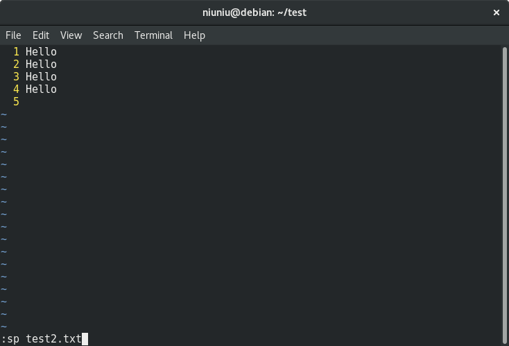
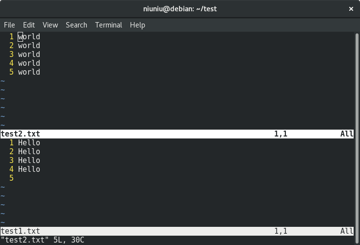
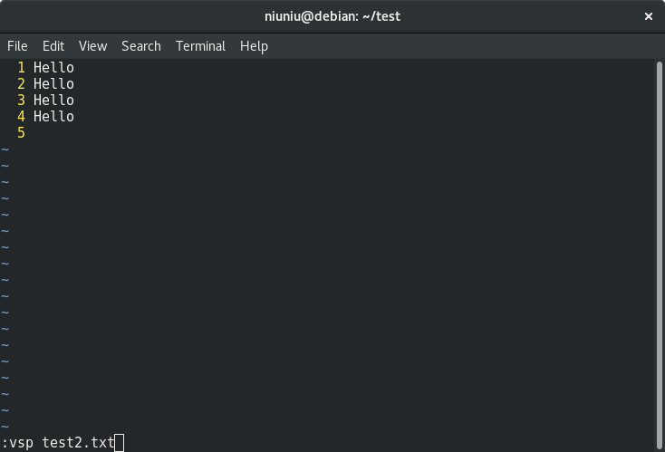
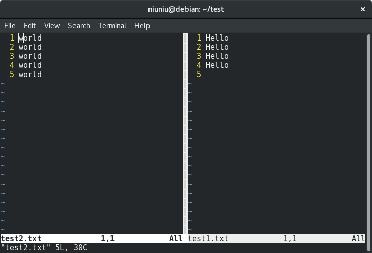

### Vi notes
---

#### 分屏
  - 上下分屏
    进入vi后，在命令模式输入`:sp file`即可在同一个vi窗口中上下分屏打来两个文件,使用Ctrl+w+w可以在多个文件间进行切换
    例如：
    - 上下分屏前
      
    - 上下分屏后
      
  - 左右分屏
    进入vi后，在命令模式输入`:vsp file`即可在同一个vi窗口中左右分屏打来两个文件,使用Ctrl+w+w可以在多个文件间进行切换
    例如：
    - 左右分屏前
      
    - 左右分屏后
      
